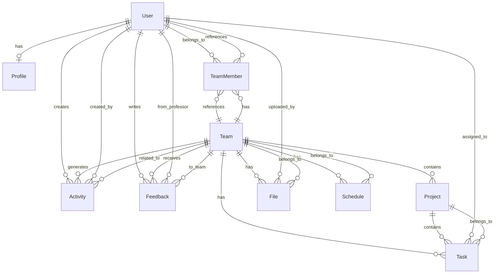

# TeamMate ERD 설계 문서

## 1. ERD 설계 방법

### 추천 도구
1. **dbdiagram.io** (추천) - 온라인 ERD 도구, SQL 생성 가능
2. **draw.io** - 무료 다이어그램 도구
3. **Mermaid** - 마크다운 기반 다이어그램 (문서화에 적합)
4. **MySQL Workbench** - MySQL 전용
5. **pgAdmin** - PostgreSQL 전용

### 설계 프로세스
1. 엔티티 식별 (명사 중심)
2. 속성 정의 (각 엔티티의 필드)
3. 관계 정의 (1:1, 1:N, N:M)
4. 제약조건 설정 (PK, FK, UNIQUE, NOT NULL)
5. 정규화 검토

## 2. 엔티티 식별

### 핵심 엔티티
1. **User** - 사용자 (학생, 교수)
2. **Profile** - 사용자 프로필 (전공, 역할, 성향)
3. **Team** - 팀
4. **Project** - 프로젝트
5. **Task** - 작업/할 일
6. **File** - 파일
7. **Schedule** - 일정 (회의, 마감일)
8. **Activity** - 활동 로그
9. **Feedback** - 피드백 (교수 → 팀)
10. **TeamMember** - 팀 멤버 (중간 테이블)
11. **Matching** - 매칭 기록

## 3. ERD 다이어그램 (Mermaid)



## 4. 상세 스키마 설계

### 4.1 User (사용자)
```sql
CREATE TABLE users (
    id BIGINT PRIMARY KEY AUTO_INCREMENT,
    email VARCHAR(255) UNIQUE NOT NULL,
    password_hash VARCHAR(255) NOT NULL,
    name VARCHAR(100) NOT NULL,
    student_id VARCHAR(50) UNIQUE,
    role ENUM('student', 'professor', 'admin') DEFAULT 'student',
    created_at TIMESTAMP DEFAULT CURRENT_TIMESTAMP,
    updated_at TIMESTAMP DEFAULT CURRENT_TIMESTAMP ON UPDATE CURRENT_TIMESTAMP,
    deleted_at TIMESTAMP NULL,
    INDEX idx_email (email),
    INDEX idx_student_id (student_id)
);
```

**속성 설명:**
- `id`: 사용자 고유 ID (PK)
- `email`: 이메일 (로그인용, UNIQUE)
- `password_hash`: 비밀번호 해시
- `name`: 이름
- `student_id`: 학번 (학생만, UNIQUE)
- `role`: 역할 (학생/교수/관리자)
- `created_at`, `updated_at`, `deleted_at`: 타임스탬프 (소프트 삭제)

### 4.2 Profile (프로필)
```sql
CREATE TABLE profiles (
    id BIGINT PRIMARY KEY AUTO_INCREMENT,
    user_id BIGINT UNIQUE NOT NULL,
    major VARCHAR(100),
    bio TEXT,
    personality ENUM('active', 'cooperative', 'analytical', 'creative', 'organized'),
    created_at TIMESTAMP DEFAULT CURRENT_TIMESTAMP,
    updated_at TIMESTAMP DEFAULT CURRENT_TIMESTAMP ON UPDATE CURRENT_TIMESTAMP,
    FOREIGN KEY (user_id) REFERENCES users(id) ON DELETE CASCADE,
    INDEX idx_user_id (user_id)
);
```

**속성 설명:**
- `user_id`: 사용자 ID (FK, 1:1 관계)
- `major`: 전공
- `bio`: 자기소개
- `personality`: 협업 성향

### 4.3 ProfileRole (프로필 역할 - N:M)
```sql
CREATE TABLE profile_roles (
    id BIGINT PRIMARY KEY AUTO_INCREMENT,
    profile_id BIGINT NOT NULL,
    role ENUM('leader', 'frontend', 'backend', 'designer', 'pm', 'researcher') NOT NULL,
    FOREIGN KEY (profile_id) REFERENCES profiles(id) ON DELETE CASCADE,
    UNIQUE KEY unique_profile_role (profile_id, role),
    INDEX idx_profile_id (profile_id)
);
```

**속성 설명:**
- 사용자는 여러 역할을 가질 수 있음 (복수 선택)

### 4.4 Team (팀)
```sql
CREATE TABLE teams (
    id BIGINT PRIMARY KEY AUTO_INCREMENT,
    name VARCHAR(255) NOT NULL,
    subject VARCHAR(255),
    description TEXT,
    max_members INT DEFAULT 6,
    status ENUM('recruiting', 'active', 'completed', 'inactive') DEFAULT 'recruiting',
    created_by BIGINT NOT NULL,
    created_at TIMESTAMP DEFAULT CURRENT_TIMESTAMP,
    updated_at TIMESTAMP DEFAULT CURRENT_TIMESTAMP ON UPDATE CURRENT_TIMESTAMP,
    FOREIGN KEY (created_by) REFERENCES users(id),
    INDEX idx_status (status),
    INDEX idx_created_by (created_by)
);
```

**속성 설명:**
- `name`: 팀 이름
- `subject`: 과목명
- `status`: 팀 상태 (모집중/활성/완료/비활성)
- `created_by`: 팀 생성자

### 4.5 TeamMember (팀 멤버 - 중간 테이블)
```sql
CREATE TABLE team_members (
    id BIGINT PRIMARY KEY AUTO_INCREMENT,
    team_id BIGINT NOT NULL,
    user_id BIGINT NOT NULL,
    role ENUM('leader', 'frontend', 'backend', 'designer', 'pm', 'researcher', 'member') DEFAULT 'member',
    joined_at TIMESTAMP DEFAULT CURRENT_TIMESTAMP,
    FOREIGN KEY (team_id) REFERENCES teams(id) ON DELETE CASCADE,
    FOREIGN KEY (user_id) REFERENCES users(id) ON DELETE CASCADE,
    UNIQUE KEY unique_team_member (team_id, user_id),
    INDEX idx_team_id (team_id),
    INDEX idx_user_id (user_id)
);
```

**속성 설명:**
- `team_id`, `user_id`: 복합 UNIQUE 제약 (한 팀에 한 번만 참여)
- `role`: 팀 내 역할

### 4.6 Project (프로젝트)
```sql
CREATE TABLE projects (
    id BIGINT PRIMARY KEY AUTO_INCREMENT,
    team_id BIGINT NOT NULL,
    title VARCHAR(255) NOT NULL,
    description TEXT,
    start_date DATE,
    end_date DATE,
    progress INT DEFAULT 0 CHECK (progress >= 0 AND progress <= 100),
    status ENUM('planning', 'in_progress', 'completed', 'cancelled') DEFAULT 'planning',
    created_at TIMESTAMP DEFAULT CURRENT_TIMESTAMP,
    updated_at TIMESTAMP DEFAULT CURRENT_TIMESTAMP ON UPDATE CURRENT_TIMESTAMP,
    FOREIGN KEY (team_id) REFERENCES teams(id) ON DELETE CASCADE,
    INDEX idx_team_id (team_id),
    INDEX idx_status (status)
);
```

**속성 설명:**
- `team_id`: 소속 팀 (FK)
- `progress`: 진행률 (0-100)
- `status`: 프로젝트 상태

### 4.7 Task (작업)
```sql
CREATE TABLE tasks (
    id BIGINT PRIMARY KEY AUTO_INCREMENT,
    project_id BIGINT NOT NULL,
    team_id BIGINT NOT NULL,
    title VARCHAR(255) NOT NULL,
    description TEXT,
    assigned_to BIGINT,
    status ENUM('todo', 'in_progress', 'completed', 'cancelled') DEFAULT 'todo',
    priority ENUM('low', 'medium', 'high') DEFAULT 'medium',
    due_date DATE,
    completed_at TIMESTAMP NULL,
    created_at TIMESTAMP DEFAULT CURRENT_TIMESTAMP,
    updated_at TIMESTAMP DEFAULT CURRENT_TIMESTAMP ON UPDATE CURRENT_TIMESTAMP,
    FOREIGN KEY (project_id) REFERENCES projects(id) ON DELETE CASCADE,
    FOREIGN KEY (team_id) REFERENCES teams(id) ON DELETE CASCADE,
    FOREIGN KEY (assigned_to) REFERENCES users(id) ON DELETE SET NULL,
    INDEX idx_project_id (project_id),
    INDEX idx_team_id (team_id),
    INDEX idx_assigned_to (assigned_to),
    INDEX idx_status (status)
);
```

**속성 설명:**
- `assigned_to`: 담당자 (FK, NULL 가능)
- `status`: 작업 상태
- `priority`: 우선순위

### 4.8 File (파일)
```sql
CREATE TABLE files (
    id BIGINT PRIMARY KEY AUTO_INCREMENT,
    team_id BIGINT NOT NULL,
    uploaded_by BIGINT NOT NULL,
    file_name VARCHAR(255) NOT NULL,
    file_path VARCHAR(500) NOT NULL,
    file_size BIGINT,
    file_type VARCHAR(100),
    description TEXT,
    created_at TIMESTAMP DEFAULT CURRENT_TIMESTAMP,
    FOREIGN KEY (team_id) REFERENCES teams(id) ON DELETE CASCADE,
    FOREIGN KEY (uploaded_by) REFERENCES users(id) ON DELETE CASCADE,
    INDEX idx_team_id (team_id),
    INDEX idx_uploaded_by (uploaded_by)
);
```

**속성 설명:**
- `file_path`: 서버 내 파일 경로
- `file_size`: 파일 크기 (bytes)
- `file_type`: MIME 타입

### 4.9 Schedule (일정)
```sql
CREATE TABLE schedules (
    id BIGINT PRIMARY KEY AUTO_INCREMENT,
    team_id BIGINT NOT NULL,
    title VARCHAR(255) NOT NULL,
    description TEXT,
    schedule_type ENUM('meeting', 'deadline', 'milestone') DEFAULT 'meeting',
    start_datetime DATETIME,
    end_datetime DATETIME,
    location VARCHAR(255),
    created_by BIGINT NOT NULL,
    created_at TIMESTAMP DEFAULT CURRENT_TIMESTAMP,
    updated_at TIMESTAMP DEFAULT CURRENT_TIMESTAMP ON UPDATE CURRENT_TIMESTAMP,
    FOREIGN KEY (team_id) REFERENCES teams(id) ON DELETE CASCADE,
    FOREIGN KEY (created_by) REFERENCES users(id) ON DELETE CASCADE,
    INDEX idx_team_id (team_id),
    INDEX idx_start_datetime (start_datetime)
);
```

**속성 설명:**
- `schedule_type`: 일정 유형 (회의/마감일/마일스톤)
- `start_datetime`, `end_datetime`: 일정 시간

### 4.10 Activity (활동 로그)
```sql
CREATE TABLE activities (
    id BIGINT PRIMARY KEY AUTO_INCREMENT,
    team_id BIGINT,
    user_id BIGINT NOT NULL,
    activity_type ENUM('task_created', 'task_completed', 'file_uploaded', 'meeting_held', 'member_joined', 'member_left', 'project_updated') NOT NULL,
    description TEXT NOT NULL,
    metadata JSON,
    created_at TIMESTAMP DEFAULT CURRENT_TIMESTAMP,
    FOREIGN KEY (team_id) REFERENCES teams(id) ON DELETE CASCADE,
    FOREIGN KEY (user_id) REFERENCES users(id) ON DELETE CASCADE,
    INDEX idx_team_id (team_id),
    INDEX idx_user_id (user_id),
    INDEX idx_created_at (created_at)
);
```

**속성 설명:**
- `activity_type`: 활동 유형
- `metadata`: 추가 정보 (JSON 형식)

### 4.11 Feedback (피드백)
```sql
CREATE TABLE feedbacks (
    id BIGINT PRIMARY KEY AUTO_INCREMENT,
    team_id BIGINT NOT NULL,
    from_user_id BIGINT NOT NULL,
    content TEXT NOT NULL,
    created_at TIMESTAMP DEFAULT CURRENT_TIMESTAMP,
    updated_at TIMESTAMP DEFAULT CURRENT_TIMESTAMP ON UPDATE CURRENT_TIMESTAMP,
    FOREIGN KEY (team_id) REFERENCES teams(id) ON DELETE CASCADE,
    FOREIGN KEY (from_user_id) REFERENCES users(id) ON DELETE CASCADE,
    INDEX idx_team_id (team_id),
    INDEX idx_from_user_id (from_user_id)
);
```

**속성 설명:**
- `from_user_id`: 피드백 작성자 (교수)
- `content`: 피드백 내용

### 4.12 Matching (매칭 기록)
```sql
CREATE TABLE matchings (
    id BIGINT PRIMARY KEY AUTO_INCREMENT,
    user_id BIGINT NOT NULL,
    team_id BIGINT,
    matching_type ENUM('auto', 'direct', 'recommend') NOT NULL,
    match_score INT,
    status ENUM('pending', 'accepted', 'rejected', 'expired') DEFAULT 'pending',
    created_at TIMESTAMP DEFAULT CURRENT_TIMESTAMP,
    expires_at TIMESTAMP,
    FOREIGN KEY (user_id) REFERENCES users(id) ON DELETE CASCADE,
    FOREIGN KEY (team_id) REFERENCES teams(id) ON DELETE SET NULL,
    INDEX idx_user_id (user_id),
    INDEX idx_team_id (team_id),
    INDEX idx_status (status)
);
```

**속성 설명:**
- `matching_type`: 매칭 방식
- `match_score`: 매칭 점수 (0-100)
- `status`: 매칭 상태

## 5. 관계 요약

### 1:1 관계
- User ↔ Profile (한 사용자는 하나의 프로필만 가짐)

### 1:N 관계
- User → TeamMember (한 사용자는 여러 팀에 참여 가능)
- Team → TeamMember (한 팀은 여러 멤버를 가짐)
- Team → Project (한 팀은 여러 프로젝트를 가짐)
- Team → Task (한 팀은 여러 작업을 가짐)
- Team → File (한 팀은 여러 파일을 가짐)
- Team → Schedule (한 팀은 여러 일정을 가짐)
- Team → Activity (한 팀은 여러 활동 로그를 가짐)
- Team → Feedback (한 팀은 여러 피드백을 받음)
- Project → Task (한 프로젝트는 여러 작업을 가짐)
- User → Activity (한 사용자는 여러 활동을 생성)
- User → Feedback (한 사용자는 여러 피드백을 작성)

### N:M 관계
- User ↔ Team (TeamMember 중간 테이블)
- Profile ↔ Role (ProfileRole 중간 테이블)

## 6. 인덱스 전략

### 주요 인덱스
1. **User**: email, student_id (로그인, 조회)
2. **Team**: status, created_by (필터링)
3. **Task**: project_id, team_id, assigned_to, status (조회, 필터링)
4. **Activity**: team_id, user_id, created_at (타임라인 조회)
5. **Schedule**: team_id, start_datetime (일정 조회)

## 7. 다음 단계

1. **데이터베이스 선택**: MySQL, PostgreSQL, MongoDB 등
2. **마이그레이션 파일 생성**: Prisma, TypeORM, Sequelize 등
3. **API 엔드포인트 설계**: RESTful API 또는 GraphQL
4. **인증 시스템**: JWT, OAuth 등
5. **파일 저장소**: AWS S3, 로컬 스토리지 등

## 8. ERD 도구 사용법

### dbdiagram.io 사용 예시
1. https://dbdiagram.io 접속
2. 아래 SQL을 입력하여 다이어그램 생성

```sql
Table users {
  id bigint [pk, increment]
  email varchar(255) [unique, not null]
  password_hash varchar(255) [not null]
  name varchar(100) [not null]
  student_id varchar(50) [unique]
  role enum [default: 'student']
  created_at timestamp [default: `CURRENT_TIMESTAMP`]
  updated_at timestamp [default: `CURRENT_TIMESTAMP`]
  deleted_at timestamp
}

Table profiles {
  id bigint [pk, increment]
  user_id bigint [unique, ref: > users.id]
  major varchar(100)
  bio text
  personality enum
  created_at timestamp [default: `CURRENT_TIMESTAMP`]
  updated_at timestamp [default: `CURRENT_TIMESTAMP`]
}

Table teams {
  id bigint [pk, increment]
  name varchar(255) [not null]
  subject varchar(255)
  description text
  max_members int [default: 6]
  status enum [default: 'recruiting']
  created_by bigint [ref: > users.id]
  created_at timestamp [default: `CURRENT_TIMESTAMP`]
  updated_at timestamp [default: `CURRENT_TIMESTAMP`]
}

Table team_members {
  id bigint [pk, increment]
  team_id bigint [ref: > teams.id]
  user_id bigint [ref: > users.id]
  role enum [default: 'member']
  joined_at timestamp [default: `CURRENT_TIMESTAMP`]
}
```

